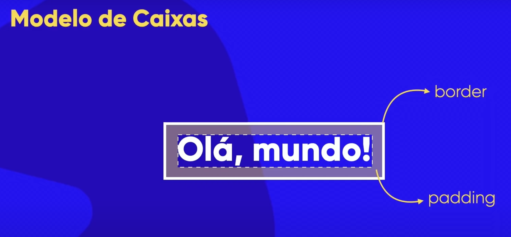
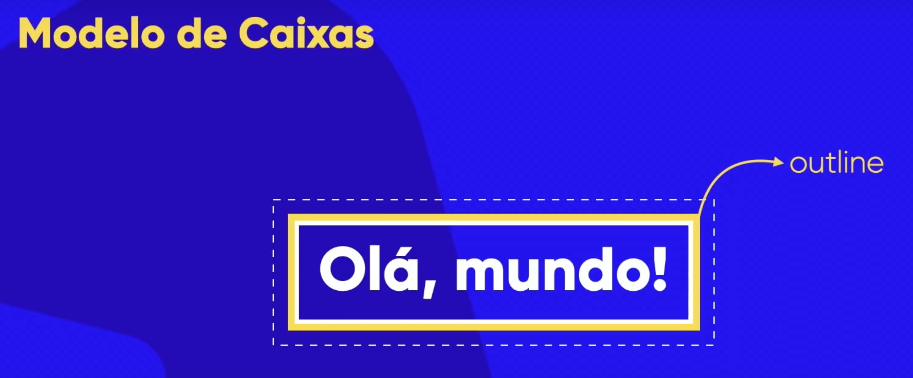
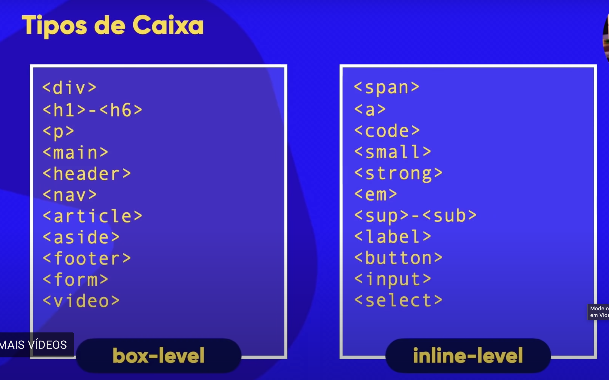

Esse repositório está sendo usado para colocar todos os arquivos e pastas do curso de HTML-CSS do Curso em Vídeo. Para entender melhor, abra o index.html mais externo e veja a página explicativa.

BOX-MODEL

